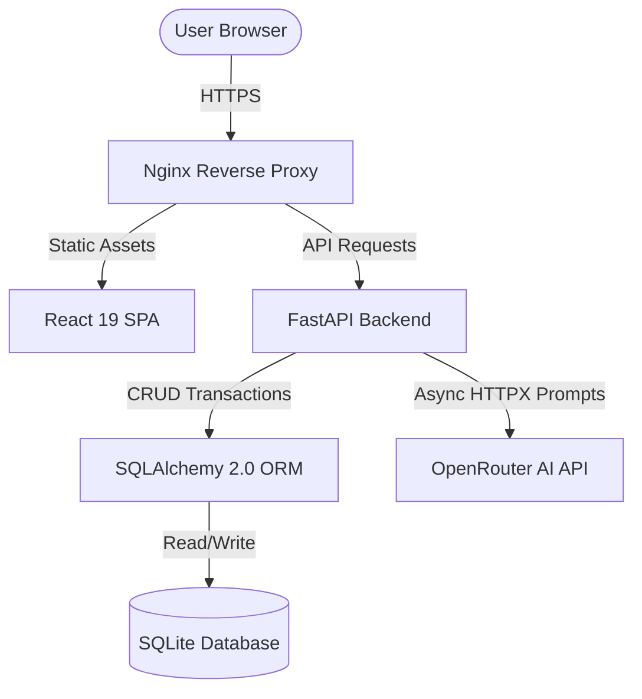
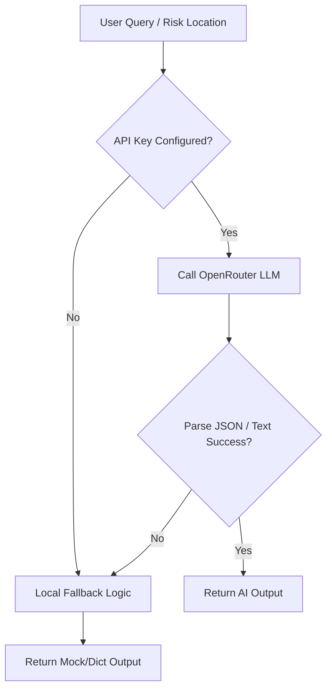

# ResQAI — AI-Powered Disaster Response Platform ⚡

<p align="center">
  
  
  
  
  
</p>

ResQAI is a production-ready, full-stack disaster response and resource coordination platform designed to optimize crisis management in real time. By utilizing live AI model integrations alongside a unified command dashboard, ResQAI helps rescue teams, volunteers, NGOs, and citizens work together during emergency situations.

---

## 🚀 Overview

ResQAI bridges the critical gap between affected citizens and emergency responders. It provides a visual live map, an automated resource and shelter distribution manager, a volunteer job task board, and an AI chat assistant. The application is built using a decoupled architecture, with a FastAPI backend serving a React 19 single-page application (SPA).

---

## ⚠️ Problem Statement

Disaster response in high-risk zones is frequently delayed by fragmented communication channels:
1. **Information Silos**: Citizens struggle to find safe shelters, while NGOs are unaware of exact relief needs.
2. **Rescuer Inefficiencies**: Rescue teams lack localized coordinates of SOS alarms.
3. **Resource Waste**: Supply distribution relies on guesswork rather than data-driven allocation.
4. **Volunteer Chaos**: Willing volunteers lack a centralized system for task assignment and status tracking.

---

## 💡 The Solution

ResQAI solves these problems by providing:
- **Centralized Live Map**: Aggregates SOS reports, shelter status, and rescue teams on a dark-themed coordinate map.
- **Incident-Linked Relief Distribution**: Deducts stock automatically and logs distributed quantities against specific incidents and shelters.
- **Intelligent Volunteer Board**: Allows volunteers to browse priority tasks, accept them, and update their completion status.
- **Async AI Integration**: Leverages OpenRouter APIs to analyze local hazard risks and provide safety instructions, with fail-safe local dictionary fallbacks.

---

## 🌟 Key Features (Fully Implemented)

- 🆘 **SOS Emergency Reporting**: Citizens can broadcast emergencies with GPS coordinates, descriptions, and direct image uploads.
- 🗺️ **Live Disaster Map**: Interactive Leaflet map displaying active incidents, shelters, hospitals, and rescue teams with custom layer toggles.
- 🚁 **Rescue Operation Console**: Allows dispatching registered rescue units to active incidents and tracking their availability status.
- 📦 **Relief & Supply Manager**: Tracks warehouse stocks (food, water, medicine) and records shelter distributions with database validations.
- 👥 **Volunteer Task Board**: CRUD task operations, skill requirements parsing, and status transitions (Assigned, Accepted, Completed).
- 🤖 **AI Assistant**: Conversational safety instructions powered by OpenRouter models with automated fallback mechanisms.
- 📊 **Analytics Dashboard**: Chart.js charts showing incident categories, resource ratios, and timeline metrics.
- 🔑 **6 Role-Based Logins**: Contextual layouts and access rules for Citizens, Volunteers, Rescue Teams, NGOs, Government Officials, and Admins.

---

## 📸 Screenshots

### 🌐 Landing Page & Authentication
| Landing Page Hero | Features Grid | Login Page |
| :---: | :---: | :---: |
|  |  |  |

### 📊 Dashboard & Live Map
| User Dashboard | Interactive Live Map | Analytics Center |
| :---: | :---: | :---: |
|  |  |  |

### 🆘 Emergency Reporting & AI
| SOS Form | AI Features Hub |
| :---: | :---: |
|  |  |

### 🚁 Resource Coordination & Volunteers
| Rescue Operations | Relief Management | Volunteer Task Board |
| :---: | :---: | :---: |
|  |  |  |

### 🔑 Administration
| User Account Console |
| :---: |
|  |

---

## 🖥️ Tech Stack

### Frontend
- **React 19** + **TypeScript** + **Vite** — core frontend application.
- **Tailwind CSS v4** — styling framework.
- **Framer Motion** — micro-animations and route transitions.
- **React Leaflet** + **Leaflet** — map visualization.
- **Chart.js** + **react-chartjs-2** — analytics rendering.
- **Lucide React** — modern iconography.
- **Zustand** — lightweight global state management.
- **Axios** — API communication client.

### Backend
- **FastAPI** — high-performance Python ASGI framework.
- **SQLAlchemy 2.0** — database ORM interface.
- **Alembic** — schema versioning and database migrations.
- **Pydantic v2** — schemas and runtime data validation.
- **Python-Jose** & **Passlib (Bcrypt)** — secure JWT authorization and password hashing.

### AI / ML Integration
- **OpenRouter API** — dynamic response generation (`nvidia/llama-nemotron-rerank-vl-1b-v2:free`).
- **HTTPX** — asynchronous API request execution.

### Database
- **SQLite** — default database for local development.
- **PostgreSQL** — ready connection configuration for production environments.

### Deployment & Infrastructure
- **Docker & Docker Compose** — multi-container environments.
- **Nginx** — production proxy and static bundle server.

---

## 🏗️ Project Architecture



---

## 📁 Folder Structure

```
resqai/
├── backend/                     # FastAPI Python Server
│   ├── alembic/                 # Alembic migration environment
│   │   └── versions/            # Database schema versions history
│   ├── routes/                  # API route endpoints modules
│   │   ├── auth.py              # JWT authentication endpoints
│   │   ├── users.py             # User profile and role management
│   │   ├── incidents.py         # Disaster incident reports
│   │   ├── sos.py               # SOS requests
│   │   ├── shelters.py          # Shelters CRUD and capacity
│   │   ├── resources.py         # Inventory and distributions
│   │   ├── rescue.py            # Rescue teams dispatch
│   │   ├── volunteers.py        # Volunteer tasks tracking
│   │   ├── chatbot.py           # AI disaster safety chatbot
│   │   ├── predictions.py       # AI risk predictions
│   │   └── analytics.py         # Summary and trends analytics
│   ├── services/
│   │   └── ai.py                # OpenRouter client helper
│   ├── main.py                  # Server app core
│   ├── database.py              # SQLAlchemy engine configuration
│   ├── models.py                # Database tables mapping
│   ├── schemas.py               # Pydantic validation schemas
│   ├── auth.py                  # JWT decoder and dependency helpers
│   ├── seed.py                  # Seed script for initial setup
│   └── requirements.txt         # Backend Python packages
│
├── frontend/                    # React 19 Client
│   ├── src/
│   │   ├── components/          # Reusable components (Navbar, Sidebar, etc.)
│   │   ├── pages/               # Views (Landing, Dashboard, Maps, SOS, etc.)
│   │   ├── context/             # AuthContext provider
│   │   ├── lib/                 # Axios clients configured
│   │   ├── types/               # TypeScript interfaces
│   │   ├── App.tsx              # Router registrations
│   │   └── index.css            # Stylesheets configurations
│   ├── package.json             # NPM dependencies list
│   └── vite.config.ts           # Development proxy and build rules
│
├── screenshots/                 # Application preview images
├── docker-compose.yml           # Production Docker setup
└── README.md                    # Core documentation
```

---

## ⚡ Installation & Setup

### Prerequisites
- **Node.js** 20+ and **npm**
- **Python** 3.11+
- **Git**

### 1. Clone the Project
```bash
git clone <repository-url>
cd resqai
```

### 2. Configure Backend
```bash
cd backend

# Create virtual environment
python -m venv venv

# Activate (Windows)
venv\Scripts\activate

# Activate (macOS/Linux)
source venv/bin/activate

# Install required dependencies
pip install -r requirements.txt
```

### 3. Configure Frontend
```bash
cd ../frontend
npm install
```

---

## 🔑 Environment Variables (.env)

Create a `.env` file in the `backend/` directory:
```env
# Database Configuration
DATABASE_URL=sqlite:///./resqai.db

# Authentication Keys
SECRET_KEY=yoursecretkeyforjwtcreationandverification
ACCESS_TOKEN_EXPIRE_MINUTES=10080

# AI Model Configuration (OpenRouter)
OPENROUTER_API_KEY=your_openrouter_api_key
OPENROUTER_MODEL=nvidia/llama-nemotron-rerank-vl-1b-v2:free
```

---

## 🏃 Running the Project

### Start Backend API
From the `backend/` directory (with venv activated):
```bash
python -m uvicorn main:app --host 0.0.0.0 --port 8000 --reload
```
- **Interactive OpenAPI Documentation**: [http://localhost:8000/docs](http://localhost:8000/docs)
- **Status Health Check**: [http://localhost:8000/health](http://localhost:8000/health)

### Start Frontend Dev Server
From the `frontend/` directory:
```bash
npm run dev
```
- **Application URL**: [http://localhost:5173](http://localhost:5173)

---

## 🤖 AI Workflow Diagram

The system handles AI requests asynchronously, falling back to offline dictionary engines if network errors, rate limits, or credentials issues occur:



---

## 🔌 API Endpoints Reference

### Authentication
- `POST /api/auth/register` — Create user profile
- `POST /api/auth/login` — Authenticate credentials and return JWT token
- `GET /api/auth/me` — Return current logged-in user
- `PUT /api/auth/change-password` — Change account password

### Disaster Incidents & SOS Reports
- `GET /api/incidents/` — Filter incident reports list
- `POST /api/incidents/` — Submit incident details
- `GET /api/incidents/{id}` — View single incident details
- `POST /api/sos/` — Create SOS alarm broadcast
- `GET /api/sos/` — View SOS list
- `PUT /api/sos/{id}/status` — Resolve or acknowledge SOS status

### Rescue & Relief Distribution
- `GET /api/rescue/teams` — View rescue teams grid
- `POST /api/rescue/teams` — Register new rescue team
- `PUT /api/rescue/teams/{id}/status` — Toggle team status (available/deployed/returning)
- `PUT /api/rescue/teams/{id}/assign` — Assign rescue team to specific incident
- `POST /api/resources/` — Create supply items stock
- `POST /api/resources/distribute` — Dispatch resources to incident location (deducts stock)
- `GET /api/resources/distributions` — View complete distribution dispatch history

### Volunteer Tasks
- `GET /api/volunteers/tasks` — List open volunteer tasks
- `POST /api/volunteers/tasks` — Register a volunteer task
- `POST /api/volunteers/tasks/{id}/accept` — Accept task (updates status)
- `POST /api/volunteers/tasks/{id}/complete` — Complete task (updates status)

### AI Assistant & Analytics
- `POST /api/chatbot/` — Chat query input
- `POST /api/predictions/analyze` — Trigger location disaster risk prediction
- `GET /api/analytics/summary` — Returns statistical dashboard analytics

---

## 🔑 Seeded Demo Credentials

| Role | Email | Password |
|---|---|---|
| **Admin** | `admin@resqai.com` | `password123` |
| **Rescue Team** | `team1@resqai.com` | `password123` |
| **Volunteer** | `volunteer1@resqai.com` | `password123` |
| **NGO Coordinator** | `ngo@resqai.com` | `password123` |
| **Government Official** | `govt@resqai.com` | `password123` |
| **Citizen** | `citizen1@resqai.com` | `password123` |

---

## 📈 Project Status & Roadmap

### Current Development Status
- **Core backend**: 100% complete. SQLite DB seeded, migrations configured, and all **36 API tests pass**.
- **Frontend SPA**: 100% complete. Fully compiling with Vite production bundler (`npm run build`).
- **AI Modules**: 100% complete. Async OpenRouter endpoints wired with clean local fail-safes.

### Implemented Modules
- User Authentication (JWT) & Role-based Access rules.
- Live Map Layers (Incidents, Shelters, Teams, heatmaps).
- Relief Warehouse & Shelter distribution deductions.
- Volunteer tasks job board.

### Upcoming Roadmap & Future Improvements
- **Live WebSocket Tracking**: Implement real-time GPS locations of dispatched rescue teams.
- **SMS Gateway Integration**: Trigger immediate offline SMS alerts to residents within landslide/flood zones.
- **Multi-region Caching**: Edge databases replication for extreme latency reduction.

---

## 🤝 Contributing

1. Fork the project.
2. Create your feature branch: `git checkout -b feature/AmazingFeature`
3. Commit your changes: `git commit -m 'Add some AmazingFeature'`
4. Push to the branch: `git push origin feature/AmazingFeature`
5. Open a Pull Request.

---

## 📄 License & Intellectual Property

© 2026 Team ResQAI. All Rights Reserved.

This repository is published for portfolio and hackathon evaluation purposes only. Unauthorized copying, redistribution, modification, reproduction, or commercial use of any part of this repository is prohibited without prior written permission from the project authors.

---

<p align="center">
  Built with ❤️ for saving lives · ResQAI 2026
</p>
